# WebScraper System Architecture

## Table of Contents
- [System Overview](#system-overview)
- [Component Architecture](#component-architecture)
- [Sequence Diagrams](#sequence-diagrams)
- [Data Flow](#data-flow)
- [Deployment Architecture](#deployment-architecture)

---

## System Overview

The WebScraper is a full-stack application that enables real-time web scraping of e-commerce platforms through a WebSocket-based interface.

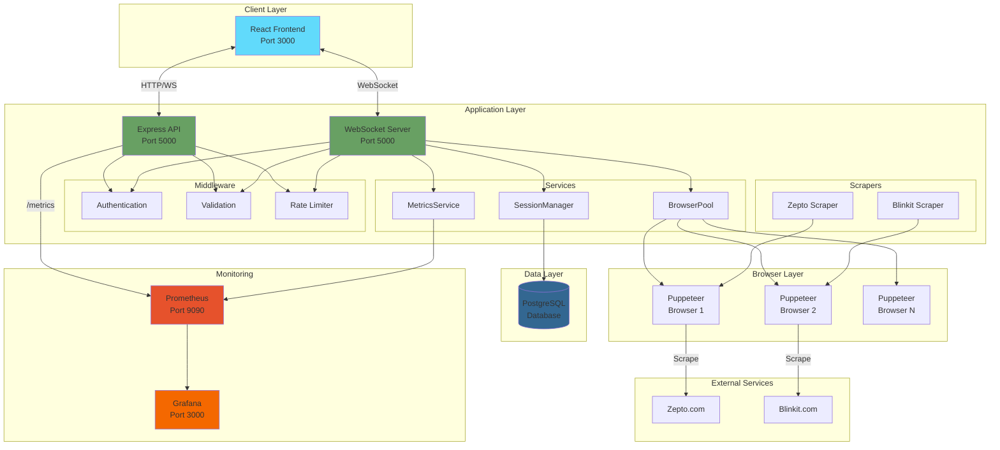

### Key Components

| Component | Technology | Purpose |
|-----------|-----------|---------|
| **Frontend** | React | User interface for scraping operations |
| **Backend** | Express.js + WebSocket | API and real-time communication |
| **Database** | PostgreSQL | Session and data persistence |
| **Browser Pool** | Puppeteer | Managed browser instances |
| **Monitoring** | Prometheus + Grafana | Metrics and visualization |

---

## Component Architecture

### Backend Component Breakdown

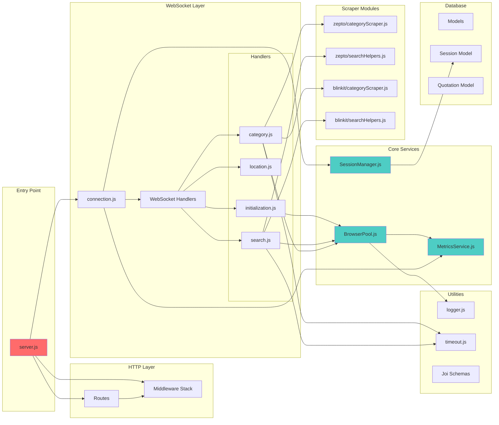

### Service Responsibilities

#### BrowserPool
- Manages Puppeteer browser instances
- Enforces resource limits (10 total, 2 per user)
- Tracks browser lifecycle and TTL
- Provides browser statistics

#### SessionManager
- Manages WebSocket session state
- Tracks location settings per service
- Persists session data to database
- Provides active session count

#### MetricsService
- Collects Prometheus metrics
- Tracks scraping operations
- Monitors browser pool utilization
- Records WebSocket connections

---

## Sequence Diagrams

### 1. WebSocket Connection Flow

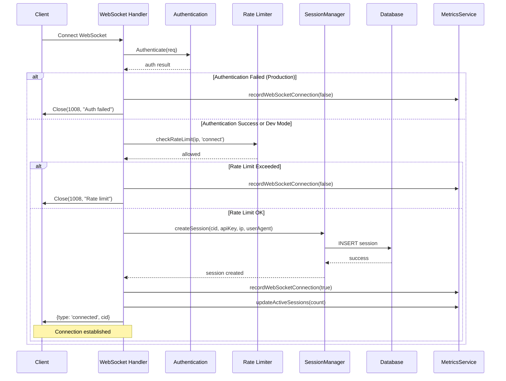

### 2. Category Scraping Flow

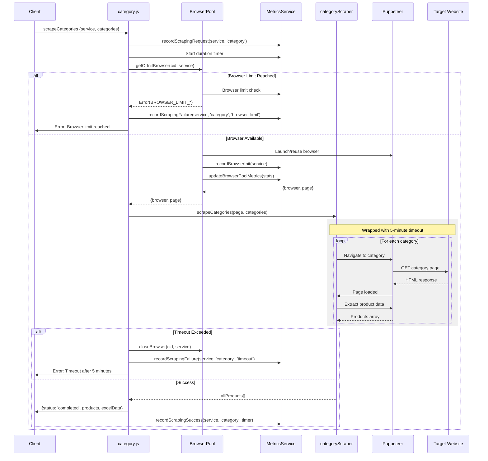

### 3. Search Flow

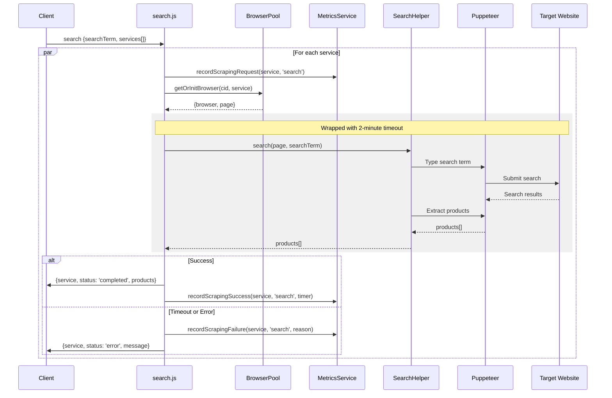

### 4. Browser Lifecycle

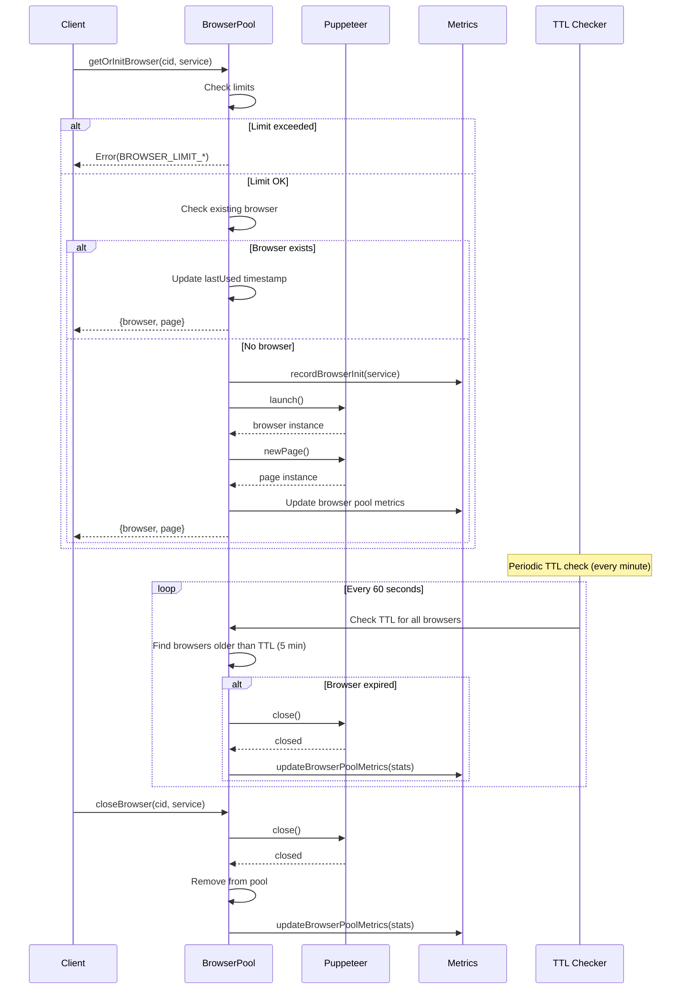

---

## Data Flow

### Request Flow

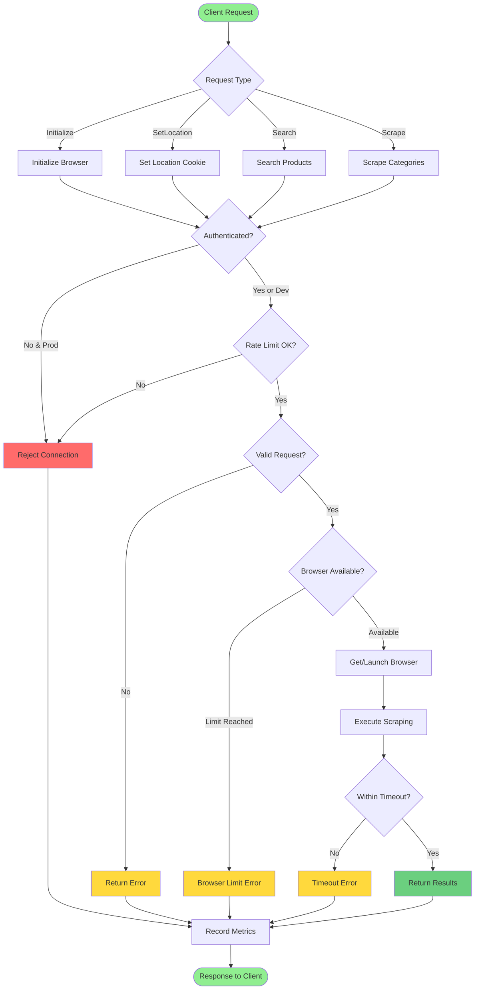

### State Management

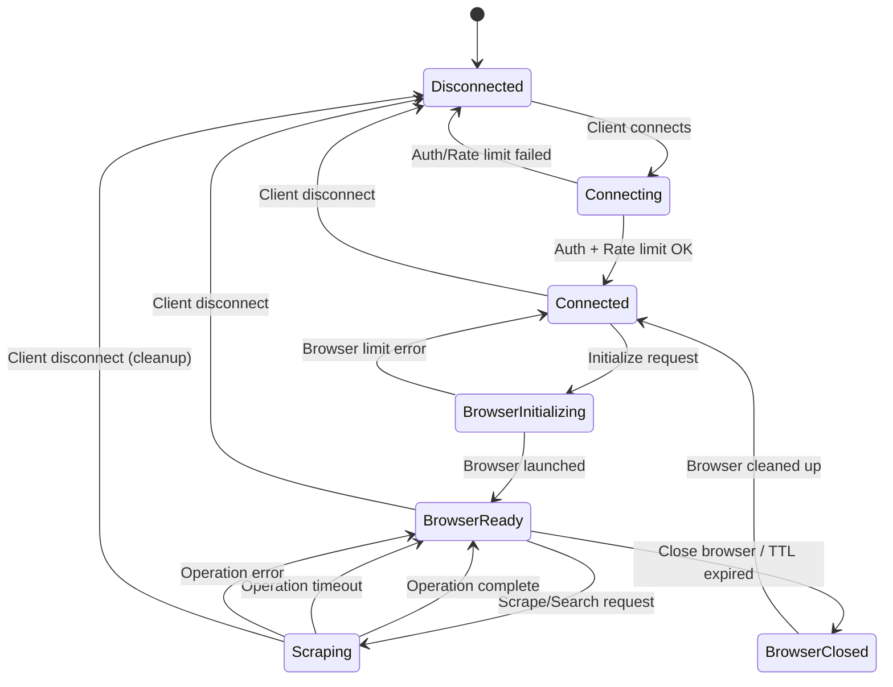

---

## Deployment Architecture

### Development Environment

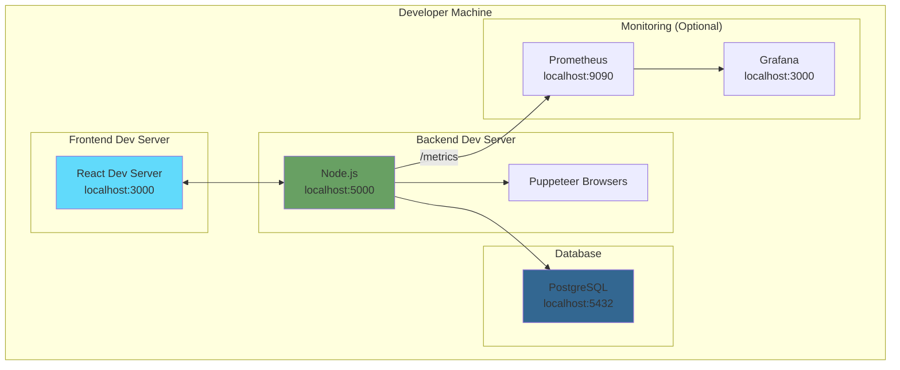

### Production Environment

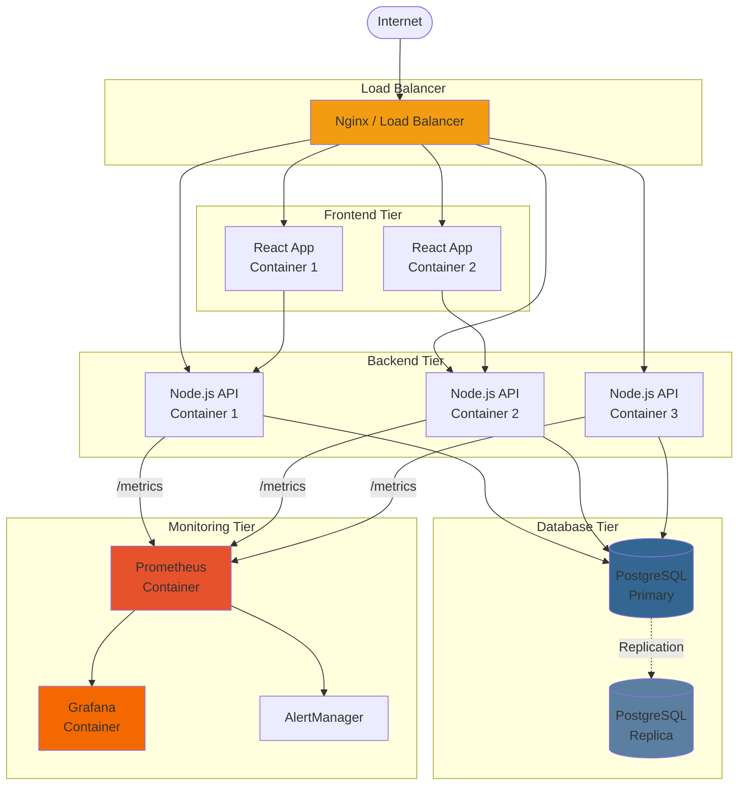

### Container Architecture

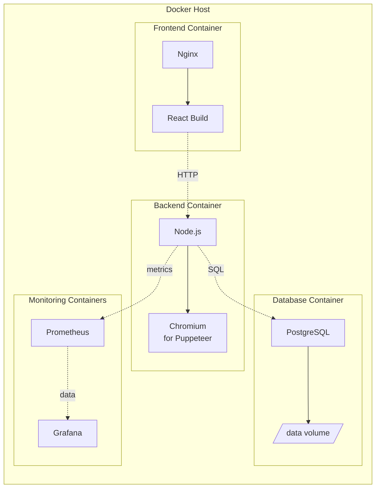

---

## Technology Stack

### Frontend
- **Framework**: React 18
- **HTTP Client**: Axios
- **WebSocket Client**: Native WebSocket API
- **Build Tool**: Vite / Create React App

### Backend
- **Runtime**: Node.js 18+
- **Framework**: Express.js 4
- **WebSocket**: ws library
- **Browser Automation**: Puppeteer
- **Database ORM**: pg (node-postgres)
- **Validation**: Joi
- **Logging**: Winston
- **Metrics**: prom-client

### Database
- **RDBMS**: PostgreSQL 14+
- **Connection Pooling**: pg Pool

### DevOps
- **Containerization**: Docker
- **Orchestration**: Docker Compose (dev), Kubernetes (prod option)
- **CI/CD**: GitHub Actions
- **Monitoring**: Prometheus + Grafana

---

## Security Architecture

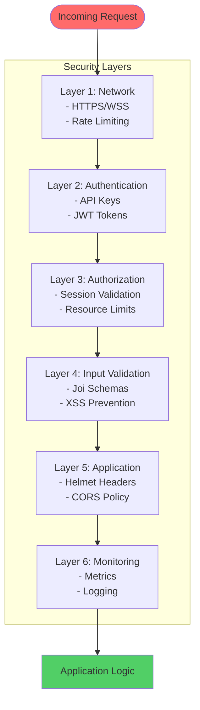

### Security Measures

| Layer | Mechanism | Implementation |
|-------|-----------|----------------|
| **Transport** | HTTPS/WSS | TLS 1.2+ |
| **Authentication** | API Keys | Header-based auth |
| **Rate Limiting** | Token bucket | Per IP limits |
| **Input Validation** | Schema validation | Joi middleware |
| **Output Encoding** | XSS prevention | Sanitization |
| **Headers** | Security headers | Helmet middleware |
| **Secrets** | Environment variables | .env files |

---

## Performance Considerations

### Resource Limits

| Resource | Limit | Rationale |
|----------|-------|-----------|
| Total browsers | 10 | Prevent memory exhaustion |
| Browsers per user | 2 | Fair resource allocation |
| WebSocket connections | Rate limited | Prevent DoS |
| Scraping timeout | 5 minutes | Prevent indefinite hangs |
| Search timeout | 2 minutes | Quick feedback |
| Browser TTL | 5 minutes | Balance reuse vs memory |

### Scalability

- **Horizontal Scaling**: Multiple backend instances behind load balancer
- **Session Affinity**: Sticky sessions for WebSocket connections
- **Database Connection Pooling**: Reuse connections efficiently
- **Browser Pool Per Instance**: Each backend manages its own pool
- **Metrics Aggregation**: Prometheus scrapes all instances

---

## Future Enhancements

1. **Queue System**: Add Redis-based job queue for scraping requests
2. **Caching**: Cache frequently-scraped categories
3. **Multi-region**: Deploy in multiple regions for lower latency
4. **Auto-scaling**: Scale based on browser pool utilization
5. **Advanced Monitoring**: APM integration (DataDog, New Relic)
6. **Database Sharding**: Partition data for better performance
